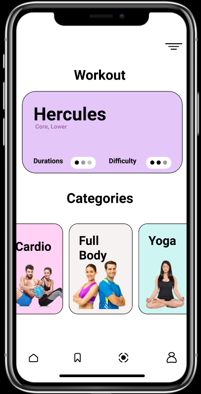
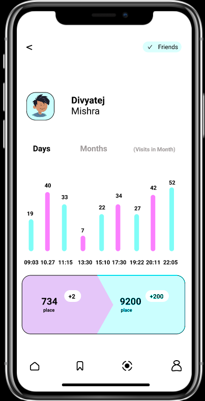
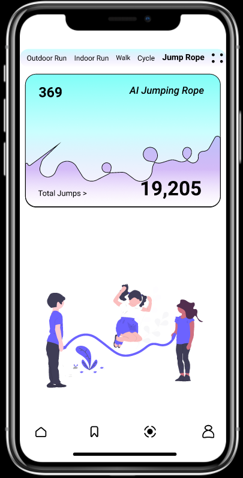
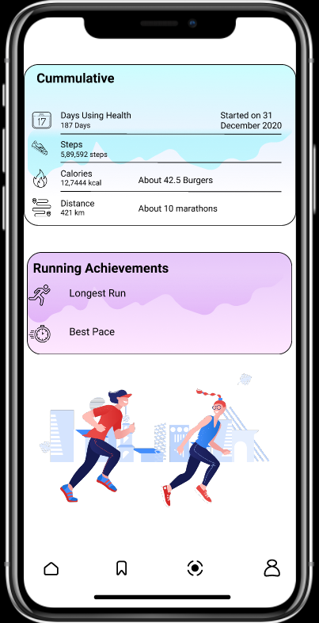

# Workout Application User Interface  
It is a simple Workout Application Interface which has 4 pages built on the Iphone X prototype with dimensions 375 x 812 px.
<br 
✔First Page - Workout + Categories. 🏋️‍♂️
✔Second Page - Daily & Monthly Steps. 🚶‍♂️
✔Third Page - AI Jumping Rope + Activities. 🤸‍♀️
✔Fourth Page - Cumulative Stats + Achievements 🎖.

I chose to utilize only 2 colours to keep it simple and elegant.

  
 
 
 
  

Link to the Figma Project:https://www.figma.com/file/VxIcD5Vgoc0VKK3xSRNejY/Workout?node-id=0%3A1

Link to the Demo Video: https://drive.google.com/file/d/1yrWh-LCj1nJKuomN5RtpUa8bZJrv2ewe/view?usp=sharing 
